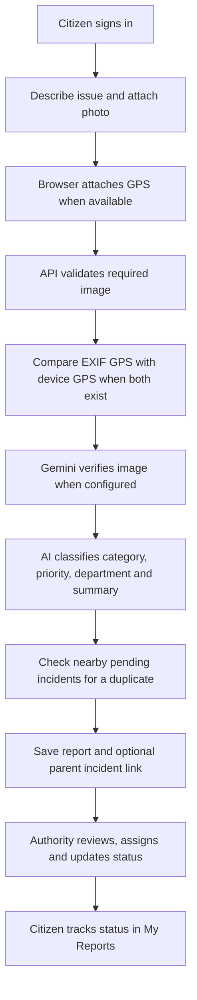
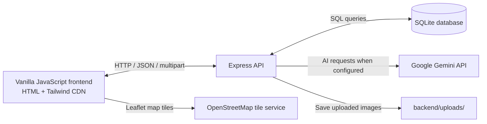
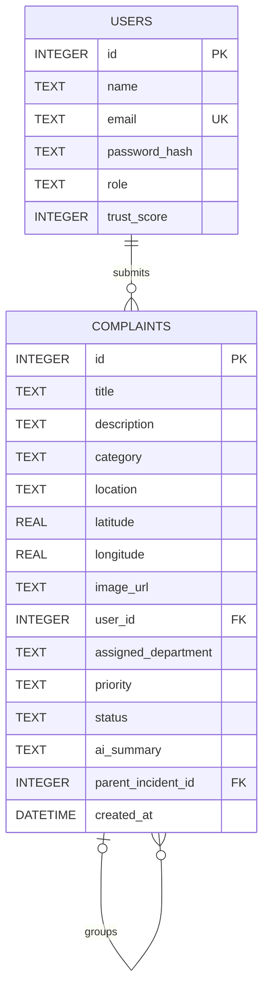

<div align="center">

# NagarSetu

### A bridge between citizens and the city services that keep communities running.

**NagarSetu** (formerly CivicFlow) is a hackathon-built civic issue reporting and management platform.

[](https://nodejs.org/)
[](https://expressjs.com/)
[](https://sqlite.org/)
[](https://ai.google.dev/)
[](./LICENSE)
[](#team)

</div>

## Table of Contents

- [About](#about)
- [Key Features](#key-features)
- [How It Works](#how-it-works)
- [Architecture](#architecture)
- [Tech Stack](#tech-stack)
- [Project Structure](#project-structure)
- [Getting Started](#getting-started)
- [Roles and Default Credentials](#roles-and-default-credentials)
- [API Reference](#api-reference)
- [Database Schema](#database-schema)
- [Trust and Anti-Abuse System](#trust-and-anti-abuse-system)
- [Screenshots](#screenshots)
- [Future Scope](#future-scope)
- [Team](#team)
- [Contributing](#contributing)
- [License](#license)
- [Acknowledgements](#acknowledgements)

## About

Residents often have no clear way to report a broken streetlight, damaged road, or overflowing drain and follow it through to resolution. Municipal teams, meanwhile, can receive incomplete reports, spend time routing them manually, and struggle to identify reports describing the same incident.

NagarSetu gives residents a place to submit a description with photo and location evidence. AI-assisted triage proposes a category, priority, responsible department, and summary. Authorized city staff can review and update reports, while residents can check the status of their own submissions.

“Nagar” means city and “Setu” means bridge: the platform is intended to be a bridge between citizens and city authorities.

## Key Features

### For Citizens

- **Account-based reporting:** Register or sign in to submit reports; report submission also requires a photo.
- **Photo evidence:** Attach a JPEG, PNG, or WEBP image to a report.
- **Location attachment:** The browser requests device location and adds coordinates to the report when available.
- **My Reports:** Signed-in users can view reports associated with their account and their current status.
- **Voice input:** Record a short voice memo in the browser. The current implementation adds a placeholder note to the description; it does not transcribe the recording.
- **Civic Heroes:** A leaderboard-style view is present in the UI with sample entries. There is no leaderboard API or database-backed leaderboard yet.

### For Authorities

- **Triage dashboard:** ADMIN and DEPARTMENT accounts can view and filter the complaint feed, view summary counts, and see reports on a map.
- **Assignment:** ADMIN accounts can assign a department and optionally adjust priority.
- **Status updates:** ADMIN and DEPARTMENT accounts can update a complaint's status.
- **Deletion and export:** ADMIN accounts can delete complaints and export the currently loaded complaint list to CSV.

### AI and Trust System

- **Complaint analysis:** Gemini can suggest a report title, category, priority, department, and engineering summary. Heuristics are used when Gemini is unavailable.
- **Image verification:** Gemini's multimodal endpoint can check whether an uploaded image appears to show a civic issue.
- **Nearby incident matching:** Nearby pending reports can be checked for a duplicate and linked to a parent incident.
- **Location consistency:** When both device coordinates and EXIF GPS are available, the backend compares them and rejects photos more than 5km away.
- **Daily submission limit:** A user's stored trust score determines their report limit. The current score starts at 50 in the schema; score changes are not implemented in the reviewed routes.

## How It Works

1. A citizen registers or signs in.
2. They describe the issue in text, optionally adding a voice memo placeholder, and attach a required photo.
3. The browser attaches its current GPS coordinates when location permission is granted.
4. The API checks the image and, when EXIF and device coordinates are available, compares the two locations.
5. Gemini (or the heuristic fallback) suggests a title, category, priority, department, and summary.
6. If coordinates are available, nearby pending reports are checked for a possible duplicate; a matched report is stored as the new report's parent incident.
7. Authorized staff review the report, assign work, and update status.
8. The citizen checks the report's status in My Reports.



## Architecture



Express serves the frontend files from `frontend/` and exposes the API under `/api`. SQLite stores users and complaints in `database/civicflow.db` (the existing filename is retained). Uploaded evidence is written to `backend/uploads/` and served under `/uploads/`. Gemini is called by the backend only when a usable `GEMINI_API_KEY` is configured.

## Tech Stack

| Layer | Technology | Purpose |
|---|---|---|
| Runtime | Node.js 18+ | Runs the backend and provides the built-in `fetch` API used by the AI service. |
| Web server | Express 4 | Serves the frontend and implements the REST API. |
| Database | SQLite (`sqlite` and `sqlite3`) | Persists accounts and complaints locally. |
| Frontend | HTML, vanilla JavaScript, Fetch API | Provides citizen, authentication, and authority interfaces. |
| Styling | Tailwind CSS CDN | Utility classes and the page's inline Tailwind theme configuration. |
| Icons | Material Symbols | UI iconography. |
| Maps | Leaflet 1.9.4 | Displays the authority incident map. |
| Map tiles | OpenStreetMap | Provides map tile imagery for Leaflet. |
| AI | Google Gemini `gemini-1.5-flash` | Optional complaint analysis, image verification, and duplicate matching. |
| Authentication | JSON Web Token, bcryptjs | Signs sessions and hashes account passwords. |
| Upload processing | Multer, exifr | Accepts image uploads and reads EXIF GPS metadata. |

## Project Structure

```text
.
├── backend/
│   ├── .env.example                 # Placeholder backend environment settings
│   ├── aiService.js                 # Gemini calls and complaint-analysis fallback
│   ├── db.js                        # SQLite initialization and query adapter
│   ├── locationVerification.js      # EXIF GPS and device-coordinate comparison
│   ├── package.json                 # Backend dependencies and start command
│   ├── package-lock.json            # Locked backend dependency versions
│   ├── server.js                    # Express app, API routes, and static hosting
│   └── uploads/                     # Runtime storage for uploaded report images
├── database/
│   ├── civicflow.db                 # Existing SQLite database file
│   └── schema.sql                   # Users and complaints table definitions
├── docs/
│   └── screenshots/
│       └── .gitkeep                 # Keeps the screenshot directory in Git
├── frontend/
│   ├── app.js                       # Frontend authentication and application behavior
│   ├── index.html                   # Citizen portal, admin interface, and auth modal
│   └── style.css                    # Design-system stylesheet
├── stitch_assets/
│   ├── screen1.html                 # Design prototype
│   ├── screen2.html                 # Design prototype
│   └── screen3.html                 # Design prototype
├── .gitignore                       # Git exclusions
├── LICENSE                          # MIT license
├── package.json                     # Root project metadata
├── package-lock.json                # Locked root dependency versions
└── README.md                        # Project documentation
```

Uploaded images and the SQLite database are runtime data. Do not commit private or sensitive user evidence.

## Getting Started

### Prerequisites

- Node.js 18 or later and npm.
- A Google Gemini API key is optional. Without it, complaint analysis uses local heuristics; image verification and incident fusion do not use Gemini.

### Install and run

1. Clone the repository and enter the project:

   ```bash
   git clone https://github.com/Chetandabhi20/code_wizard.git
   cd code_wizard
   ```

2. Install backend dependencies:

   ```bash
   cd backend
   npm install
   ```

3. Create the backend environment file:

   ```powershell
   Copy-Item .env.example .env
   ```

   On macOS or Linux, use `cp .env.example .env`.

4. Edit `backend/.env` and set a strong, private JWT secret. Add a Gemini API key if you want to enable Gemini-backed features:

   ```dotenv
   PORT=5000
   JWT_SECRET=replace_with_a_long_random_secret
   GEMINI_API_KEY=your_actual_gemini_api_key_here
   ```

   To generate a random JWT secret with Node.js:

   ```bash
   node -e "console.log(require('crypto').randomBytes(32).toString('hex'))"
   ```

   The `GEMINI_API_KEY` example value is a placeholder, not a working key. If the key is absent or remains the placeholder, complaint analysis uses heuristics, image verification accepts images without Gemini verification, and incident fusion returns no match. Gemini request or parsing failures in the AI service also use fallback behavior.

5. Start the backend from the `backend/` directory:

   ```bash
   npm start
   ```

6. Open [http://localhost:5000](http://localhost:5000). Express serves the frontend and API from the same origin.

The backend creates `database/civicflow.db` and initializes its schema when it connects. It also creates the default administrator account if that email is not already present.

### Upload size note

The backend Multer configuration accepts files up to **20MB** and filters for JPEG, PNG, and WEBP by extension and MIME type. The browser-side report form currently rejects files larger than **5MB** before sending them. These limits differ; the browser limit is the effective limit for normal UI submissions. The upload middleware's direct size-error message still says 5MB even though the configured server limit is 20MB.

## Roles and Default Credentials

| Role | How it is created | Permissions in the current API |
|---|---|---|
| `CITIZEN` | Created by public registration. | Submit a report with an image and view reports associated with their account. |
| `DEPARTMENT` | Created or assigned outside public registration; no role-management endpoint is implemented. | Submit reports, view the authority complaint feed, and update complaint status. |
| `ADMIN` | Seeded when the configured database does not already have the default admin email. | Submit reports, view the authority complaint feed, assign complaints, update status, and delete complaints. |

The seeded development credentials are:

| Email | Password |
|---|---|
| `admin@civicflow.org` | `admin123` |

Change the default administrator password before deploying the application. The current API does not include a password-change endpoint.

## API Reference

All API routes are prefixed with `/api`. Protected endpoints expect:

```http
Authorization: Bearer <JWT>
```

Registration and login return a signed token that expires after seven days. Report submission accepts multipart form data and requires both authentication and an image. No role is restricted from submitting a report.

<details>
<summary>View endpoint reference and examples</summary>

### Authentication

| Method | Endpoint | Auth | Role | Description |
|---|---|---|---|---|
| `POST` | `/api/auth/register` | No | Public; creates `CITIZEN` | Register with `name`, `email`, and `password`. |
| `POST` | `/api/auth/login` | No | Public | Exchange account credentials for a JWT. |

### Complaints

| Method | Endpoint | Auth | Role | Description |
|---|---|---|---|---|
| `POST` | `/api/complaints` | Bearer JWT | Any authenticated role | Submit a report. Multipart fields: `prompt`, `location`, optional `latitude` and `longitude`, and required `image`. |
| `GET` | `/api/complaints/my-reports` | Bearer JWT | Any authenticated role | List reports whose `user_id` matches the signed-in user. |
| `GET` | `/api/complaints` | Bearer JWT | `ADMIN`, `DEPARTMENT` | List reports; optional query filters: `status`, `department`, and `priority`. Returns summary statistics too. |
| `PATCH` | `/api/complaints/:id/assign` | Bearer JWT | `ADMIN` | Set the assigned `department`; optional `priority` is applied when supplied. Sets status to `ASSIGNED`. |
| `PATCH` | `/api/complaints/:id/status` | Bearer JWT | `ADMIN`, `DEPARTMENT` | Set the report `status`. |
| `DELETE` | `/api/complaints/:id` | Bearer JWT | `ADMIN` | Delete a report. |

The leaderboard has no API endpoint in the current server. Report status values are stored as strings; the current UI uses `PENDING`, `ASSIGNED`, `IN_PROGRESS`, `RESOLVED`, and `SHADOWBANNED`.

### Login example

Request:

```bash
curl -X POST http://localhost:5000/api/auth/login \
  -H "Content-Type: application/json" \
  -d '{"email":"admin@civicflow.org","password":"admin123"}'
```

Successful response (`200`; token abbreviated here):

```json
{
  "success": true,
  "message": "Logged in!",
  "user": {
    "id": 1,
    "name": "System Administrator",
    "email": "admin@civicflow.org",
    "role": "ADMIN"
  },
  "token": "<signed-jwt>"
}
```

### Submit a complaint example

Replace `<JWT>` and `./photo.jpg` with your own values. The upload must be JPEG, PNG, or WEBP.

```bash
curl -X POST http://localhost:5000/api/complaints \
  -H "Authorization: Bearer <JWT>" \
  -F "prompt=There is a deep pothole near the intersection" \
  -F "location=Main Street, near the library" \
  -F "latitude=40.7128" \
  -F "longitude=-74.0060" \
  -F "image=@./photo.jpg;type=image/jpeg"
```

Successful response (`201`; database-generated fields abbreviated):

```json
{
  "success": true,
  "message": "Issue processed and classified by AI successfully!",
  "complaint": {
    "id": 42,
    "title": "Deep Pothole Near Library",
    "category": "Roads",
    "description": "There is a deep pothole near the intersection",
    "location": "Main Street, near the library",
    "latitude": 40.7128,
    "longitude": -74.006,
    "image_url": "/uploads/complaint-<generated-name>.jpg",
    "user_id": 1,
    "assigned_department": "Roads",
    "priority": "HIGH",
    "status": "PENDING",
    "ai_summary": "<generated summary>",
    "parent_incident_id": null
  }
}
```

</details>

## Database Schema

The database schema defines two tables:

### `users`

| Column | Type | Notes |
|---|---|---|
| `id` | `INTEGER` | Auto-incrementing primary key. |
| `name` | `TEXT` | Required. |
| `email` | `TEXT` | Required and unique. |
| `password_hash` | `TEXT` | Required; stores a bcrypt hash. |
| `role` | `TEXT` | Defaults to `CITIZEN`. |
| `trust_score` | `INTEGER` | Defaults to `50`. |

### `complaints`

| Column | Type | Notes |
|---|---|---|
| `id` | `INTEGER` | Auto-incrementing primary key. |
| `title`, `description`, `category`, `location` | `TEXT` | Required report details. |
| `latitude`, `longitude` | `REAL` | Optional device coordinates. |
| `image_url` | `TEXT` | Image path saved by the server. |
| `user_id` | `INTEGER` | References the submitting user. |
| `assigned_department`, `priority`, `ai_summary` | `TEXT` | Triage and assignment details. |
| `status` | `TEXT` | Defaults to `PENDING`. |
| `parent_incident_id` | `INTEGER` | Optional self-reference; parent deletion sets it to `NULL`. |
| `created_at` | `DATETIME` | Defaults to the current SQLite timestamp. |



The physical database file is currently named `database/civicflow.db`; the filename is retained for compatibility with existing data.

## Trust and Anti-Abuse System

- **Authentication:** Passwords are hashed with bcrypt. JWTs expire after seven days. Protected routes require a valid bearer token.
- **Required evidence:** A report must be submitted by an authenticated user and include a supported image file.
- **Upload filtering:** The backend accepts `.jpg`, `.jpeg`, `.png`, and `.webp` files only when their MIME type is also an allowed image type. Multer's configured limit is 20MB.
- **Trust-based daily limit:** The server starts from a base allowance of three reports in the last 24 hours. For trust scores above 50, it adds one report per complete 20 points. A negative trust score bypasses this daily check and marks a new report `SHADOWBANNED`. The reviewed routes read but do not update trust scores.
- **Image verification:** With a configured Gemini key, an image is sent for civic-issue verification. If no key is configured, verification accepts the upload without AI review. The AI service also currently fails open when its Gemini verification request throws an error.
- **EXIF and device GPS:** If both coordinate sources are available, the backend rejects an image whose EXIF location is more than 5km from the device coordinates. Missing EXIF GPS or an EXIF parsing error is accepted without location verification; if device coordinates are missing, comparison is skipped.
- **Incident fusion:** When device coordinates exist, the server searches for up to five pending reports in an approximate 100m bounding box. If candidates exist and Gemini is configured, it can link a matching report through `parent_incident_id`. The new report is still stored separately.

Use a strong `JWT_SECRET`, rotate the default administrator password, and configure production controls before deploying with real citizen data.

## Screenshots

<!-- TODO: add screenshots -->

| Screen | Preview |
|---|---|
| Home |  |
| Report form |  |
| My Reports |  |
| Admin dashboard |  |
| Civic Heroes leaderboard |  |

Add the corresponding image files under `docs/screenshots/` when screenshots are available.

## Future Scope

- Add multi-language support and a mobile-friendly PWA or native mobile app.
- Send status updates through SMS or email.
- Track department service-level agreements and resolution timelines.
- Build a public transparency dashboard with verified, aggregate service metrics.
- Offer a WhatsApp reporting bot with a clear consent and evidence workflow.
- Migrate from the local SQLite database to PostgreSQL for larger deployments.
- Add real data services for the Civic Heroes leaderboard and account trust-score changes.
- Add account recovery, password changes, and administrator credential management.

## Team

**Team:** [Team Name]<br>
**Hackathon:** [Hackathon Name]

| Name | Role | GitHub / LinkedIn |
|---|---|---|
| [Your Name] | [Your Role] | [Profile URL] |
| [Team Member Name] | [Team Member Role] | [Profile URL] |

**Live demo:** [Add live demo link]

## Contributing

Contributions are welcome. To propose a change:

1. Fork the repository and create a focused feature branch.
2. Make the change and verify it locally.
3. Open a pull request describing the change, how it was tested, and any relevant screenshots.

Please do not include real API keys, passwords, database files containing private data, or uploaded citizen images in commits.

## License

This project is licensed under the MIT License. See [LICENSE](./LICENSE) for details.

## Acknowledgements

- [Google Gemini](https://ai.google.dev/) for optional generative AI and image-analysis capabilities.
- [Leaflet](https://leafletjs.com/) and [OpenStreetMap](https://www.openstreetmap.org/) for interactive maps and map data.
- [Tailwind CSS](https://tailwindcss.com/) for utility-first styling.
- [Material Symbols](https://fonts.google.com/icons) for interface icons.
